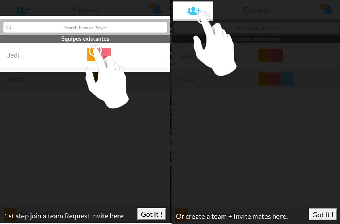

# js-walkthrough
Walkthrought with easy steps-by-steps inspired by https://github.com/souly1/ng-walkthrough

After not finding an easy way to do a steps by steps walkthrough on my app.

 
#Specs
- no dependencies, 100% js
- made for mobile (Ionic Framework) but works everywhere
- few options but good enought for my need
- 200 lines of code

# Usage

     var walkthroughList = [
     	{
     		//minimal required
        	id: 'walk-create-team',
        	text: 'Or create a team + Invite mates here.'
        	
        	fadeOut: true, // fadeout the rest of the screen
        	//OR
        	showIcon: true // show finger icon
      	}
      	{
        	id: 'walk-list-teams', // tagetId
        	text: '1st step join a team,Request invite here', 
        	fadeOut: true, // fadeout the rest of the screen
        	showIcon: true // show icon
        	icon: 'single_tap' // single_tap, double_tap, swipe_down, swipe_left, swipe_right, swipe_up, arrow
      	}
    ];
    
    walkthrough.init(walkthroughList);
    walkthrough.options({
    	debug: true,
    	gotIt:'Yeah I Got It',
    	iconsSize:100,
    	fadeOutOpacity:0.5
    });
    walkthrough.start();
    walkthrough.onFinish = function(){};

